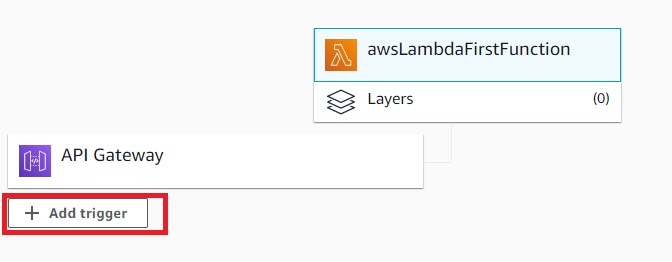

#AWS Gateway wit AWS Lambda:
Project based on "spring cloud function and cloud lambda demo project" contains one module:
- cloud-lambda: Just one change after base project - input type changed to APIGatewayProxyRequestEvent to handle Gateway trigger events.

##Add AWS Gateway to lambda function:

